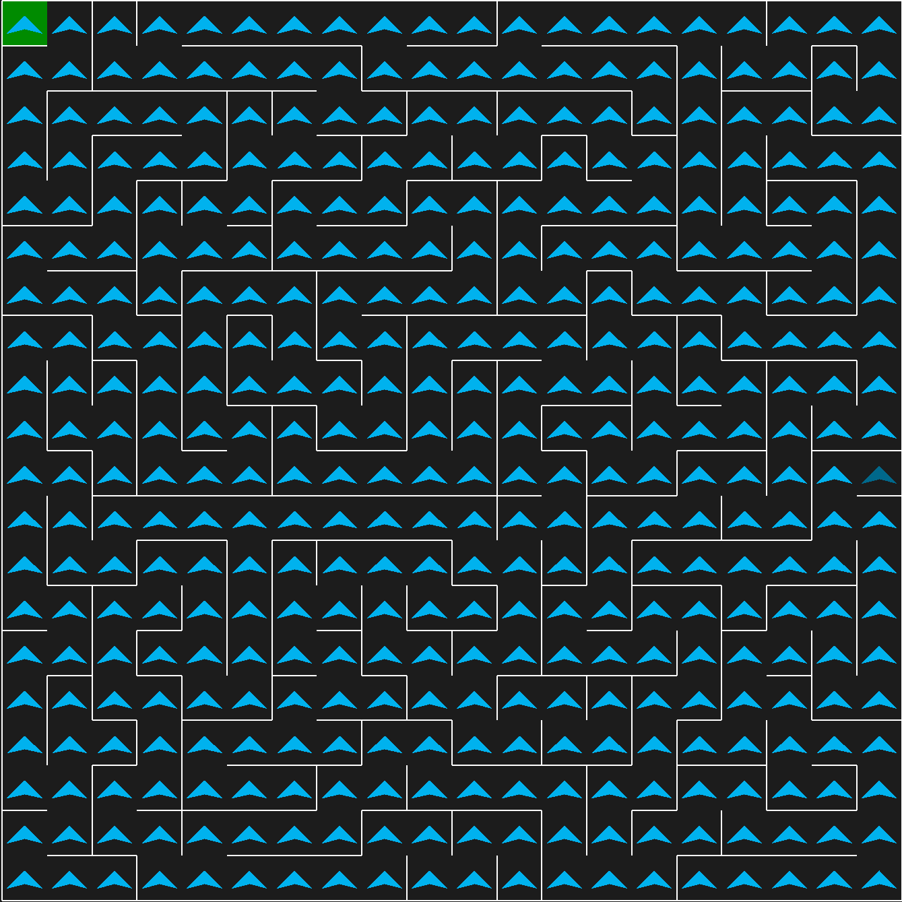

# Mapping
In order to utilising the left-hand following algorithm in order to research every single cell on the maze.
You would need to first setup a Pyamaze maze and call the method "research_maze" and pass the generated maze map
and provide starting cell of the maze.

This method will return a list of tuples which will contain each cell
that the algorithm has mapped.

```python
"""Solving the maze

Contains functionality to navigate a maze.
"""

from typing import Dict, List, Tuple


def rotate_agent_clockwise(agent_direction: dict[str, str]) -> Dict:
    """Rotates agent's direction clockwise 90 degrees.

    Args:
        agent_direction: Direction of the maze agent.

    Returns:
        An updated agent's direction.
    """
    keys = list(agent_direction.keys())
    values = list(agent_direction.values())
    values_rotated = [values[-1]] + values[:-1]
    return dict(zip(keys, values_rotated))


def rotate_agent_anticlockwise(agent_direction: dict[str, str]) -> Dict:
    """Rotates agent's direction anticlockwise -90 degrees.

    Args:
        agent_direction: Direction of the maze agent.

    Returns:
        An updated agent's direction.
    """
    keys = list(agent_direction.keys())
    values = list(agent_direction.values())
    values_rotated = values[1:] + [values[0]]
    return dict(zip(keys, values_rotated))


def move_agent_forward(
    position: tuple[int, int], direction: dict[str, str]
) -> Tuple[int, int]:
    """Calculate the position which the agent should visit.

    Args:
        position: The position of the agent
        direction: The path options for the agent

    Returns:
        An updated position which the agent should visit next.
    """
    forward_direction = direction["forward"]
    if forward_direction == "E":
        return tuple([position[0], position[1] + 1])
    if forward_direction == "W":
        return tuple([position[0], position[1] - 1])
    if forward_direction == "N":
        return tuple([position[0] - 1, position[1]])
    if forward_direction == "S":
        return tuple([position[0] + 1, position[1]])

    return position


def research_maze(
    maze_map: dict[tuple[int, int], dict[str, str]],
    start_position: tuple[int, int],
) -> List:
    """Research the whole maze to find the available paths

    Args:
        maze_map: Each cells contains information about the status
            of which path is either opened or closed.
        start_position: The starting position of the maze.

    Returns:
        A maze with all its possible cells visited.
    """
    if len(maze_map) < 1:
        return []

    agent_direction = {
        "forward": "N",
        "left": "W",
        "back": "S",
        "right": "E",
    }
    researched_maze = [start_position]

    agent_position = start_position
    while True:
        # removing the starting position from maze map
        if len(researched_maze) == len(maze_map):
            break

        if maze_map[agent_position][agent_direction["left"]] == 0:
            if maze_map[agent_position][agent_direction["forward"]] == 0:
                agent_direction = rotate_agent_clockwise(agent_direction)
            else:
                agent_position = move_agent_forward(
                    agent_position, agent_direction
                )
        else:
            agent_direction = rotate_agent_anticlockwise(agent_direction)
            agent_position = move_agent_forward(
                agent_position, agent_direction
            )

        if agent_position not in researched_maze:
            researched_maze.append(agent_position)

    return researched_maze
```

Screenshot of the completed mapping:

