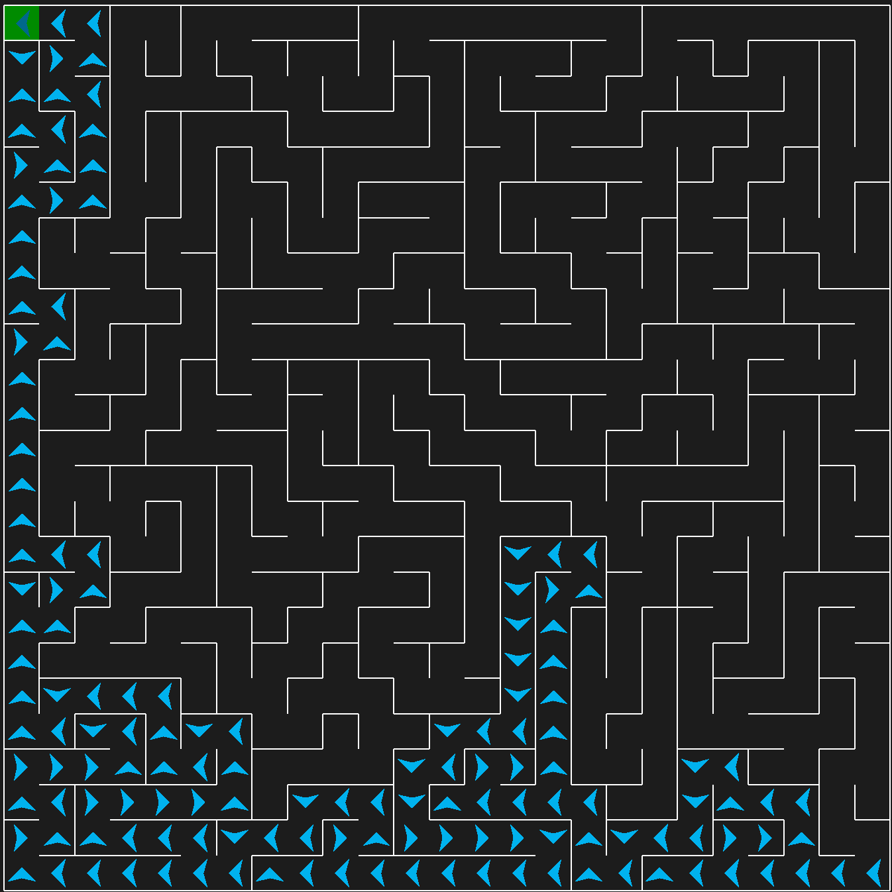

# Traversal
In order to successfully traverse the maze you would call "path_maze_end_goal" method and it would return a path which
can be used by Pyamaze in order to control the agent movement. You would provide the method with a list of the cells
which are stored as a tuple which contains row and column of the cell.

You can provide a goal but by default it sets it to (1, 1) which is what the default end goal for a Pyamaze

```python
"""Solving the maze

Contains functionality to navigate a maze.
"""

from typing import Dict, List, Tuple

def path_maze_end_goal(
    researched_maze: list[tuple[int, int]], goal: tuple[int, int] = (1, 1)
) -> Dict[Tuple[int, int], dict[str, str]]:
    """Creates the path for the agent to travel to the goal.

    Args:
        researched_maze: Traversed cells.
        goal: Objective which the maze must reach
            in order to be sucessfully traversed. Defaults to (1, 1).

    Returns:
        A path containing the order in which the maze must be traversed
            to each the end goal.
    """
    path = {}
    for index, cell in enumerate(researched_maze):
        if cell == goal:
            path[cell] = researched_maze[index]
            break

        if index < len(researched_maze) - 1:
            path[cell] = researched_maze[index + 1]

    return path
```

Screenshot of the traversal:


